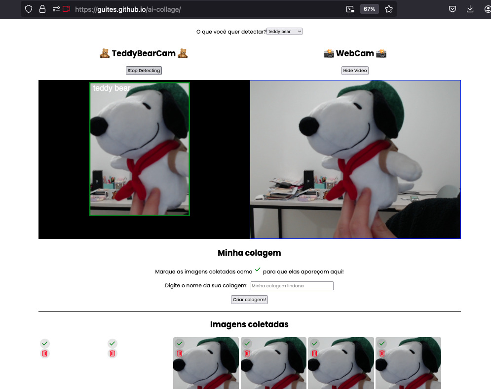

# AI Collage

Este app combina um modelo de detecção de objetos com o uso da webcam, e bate fotos automaticamente sempre que detectar o **objeto de interesse**.

Os objetos disponíveis para detecção são baseados nas classes disponíveis no dataset COCO (<https://cocodataset.org/#home>).

As fotos tiradas podem ser baixadas individualmente ou usadas para criação de uma colagem.

Você pode testar o projeto em <https://guites.github.io/ai-collage/>.

## Como rodar o projeto localmente

Baixe o repositório e acesse o seu diretório:

```shell
git clone git@github.com:guites/ai-collage.git
cd ai-collage
```

Depois, basta abrir o arquivo `index.html` no seu navegador preferido.

## Exemplos

Modelo detectando objetos através do feed da webcam.



Imagens detectadas separadas em uma montagem.


